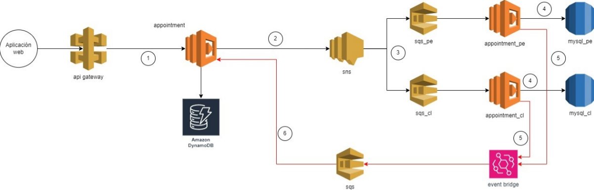
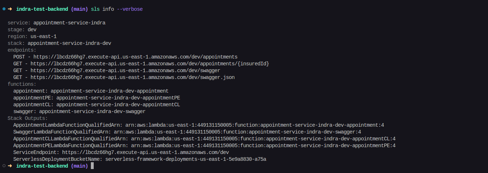
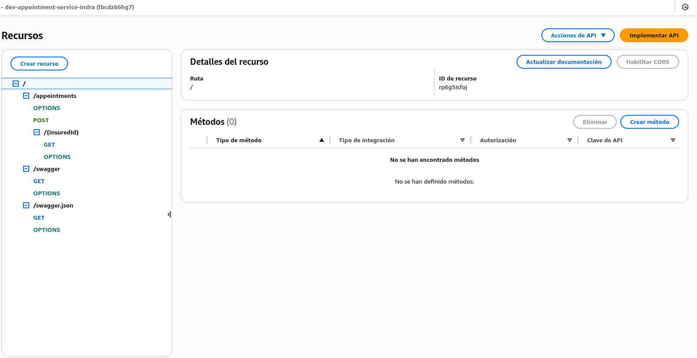
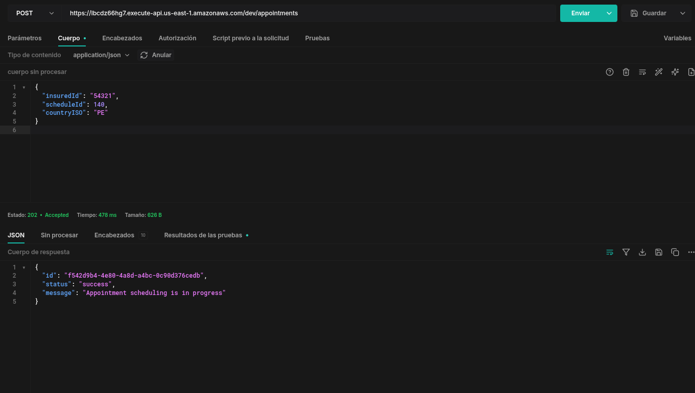
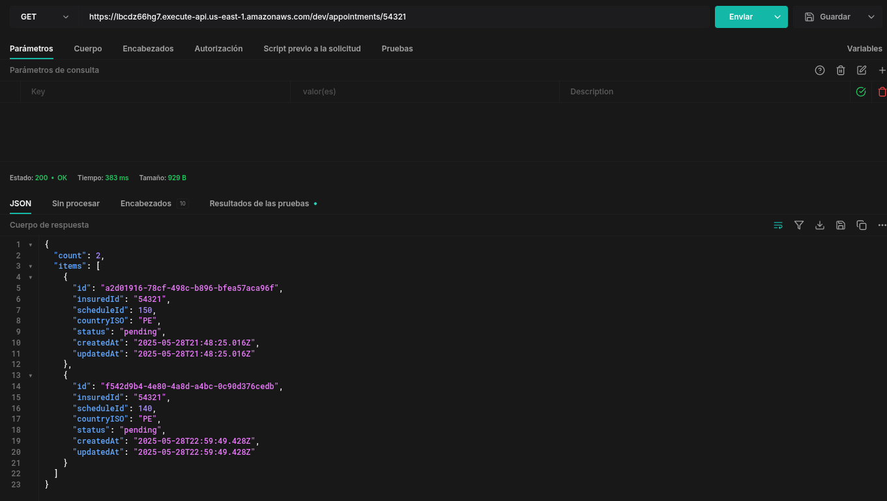

# Sistema de Agendamiento de Citas Médicas

Este proyecto implementa un sistema serverless para agendar citas médicas para asegurados en Perú y Chile, construido con TypeScript, AWS Lambda, y el Framework Serverless.

## Arquitectura

El sistema utiliza una arquitectura hexagonal (puertos y adaptadores) para mantener el código limpio, modular y fácil de probar. La arquitectura se compone de:

- **Dominio**: Contiene las entidades y la lógica de negocio principal
- **Aplicación**: Contiene los casos de uso que orquestan la lógica de dominio
- **Infraestructura**: Implementa los adaptadores para interactuar con servicios externos (AWS, bases de datos)

### Componentes AWS

- **API Gateway**: Expone los endpoints REST
- **Lambda**: Procesa las solicitudes (1 principal, 2 específicos por país)
- **DynamoDB**: Almacena el estado de las citas
- **SNS**: Enruta mensajes según país
- **SQS**: Maneja procesamiento asíncrono
- **EventBridge**: Coordina eventos de sistema
- **RDS (MySQL)**: Base de datos por país

### Patrones de Diseño

- **Patrón Repositorio**: Abstrae acceso a datos
- **Patrón Factory**: Crea servicios específicos por país
- **Patrón Mediador**: Coordina comunicación entre componentes

## Flujo de Procesamiento

1. El usuario envía una solicitud de agendamiento al API Gateway
2. Lambda `appointment` recibe la solicitud y guarda en DynamoDB (estado "pending")
3. Lambda publica mensaje en SNS
4. SNS enruta a SQS según país (PE o CL)
5. Lambda específico del país (`appointment_pe` o `appointment_cl`) procesa y guarda en MySQL
6. Lambda del país envía evento de confirmación a EventBridge
7. EventBridge envía mensaje a SQS de respuesta
8. Lambda `appointment` lee mensaje y actualiza estado en DynamoDB a "completed"

<div align="center">
    
    <p><em>Diagrama del flujo de procesamiento de citas médicas</em></p>
</div>

## Endpoints API

- **POST /appointments**: Crea una nueva cita
- **GET /appointments/{insuredId}**: Obtiene citas por ID de asegurado

## Documentación de API

La API está documentada con OpenAPI/Swagger y es accesible a través de los siguientes endpoints:

- **GET /swagger**: Interfaz interactiva de Swagger UI para explorar y probar la API
- **GET /swagger.json**: Definición OpenAPI en formato JSON

Para acceder a la documentación, simplemente visite la ruta `/swagger` en su navegador después de desplegar o ejecutar la aplicación localmente.

## Documentación Técnica

### Estructura del Proyecto

La estructura está pensada para representar claramente la arquitectura hexagonal:

- `/src/appointments/domain`: Entidades y lógica de negocio
- `/src/appointments/application`: Casos de uso y manejadores de eventos
- `/src/appointments/infrastructure`: Repositorios y servicios AWS
- `/src/swagger`: Definición OpenAPI/Swagger de la API
- `/test`: Pruebas unitarias y de integración

### Requerimientos

- Node.js 20.x o superior
- AWS CLI configurado con permisos adecuados
- Framework Serverless

### Instalación

```bash
# Clonar el repositorio
git clone [url-repositorio]
cd indra-test-backend

# Instalar dependencias
npm install

# Ejecutar pruebas
npm test

# Desplegar en AWS
npm run deploy
```

### Configuración

El archivo `serverless.yml` contiene toda la configuración para el despliegue en AWS. Las variables sensibles como credenciales de base de datos deben configurarse en AWS Parameter Store o Secrets Manager.

## Pruebas

Las pruebas unitarias cubren las entidades de dominio, casos de uso y manejadores, asegurando que la lógica de negocio funcione correctamente. Para ejecutar las pruebas:

```bash
npm test
```

## Consideraciones

- El sistema está diseñado para procesar citas médicas en Perú y Chile.
- El código se escribe siguiendo los principios SOLID y patrones de arquitectura limpia.
- La implementación mantiene separación clara entre la lógica de negocio y la infraestructura.
- El sistema utiliza procesamiento asíncrono para mejor rendimiento y escalabilidad.

## Despliegue

Endpoints disponibles:

- POST - https://lbcdz66hg7.execute-api.us-east-1.amazonaws.com/dev/appointments/
- GET - https://lbcdz66hg7.execute-api.us-east-1.amazonaws.com/dev/appointments/{insuredId}

Endpoints de documentación:

- GET - https://lbcdz66hg7.execute-api.us-east-1.amazonaws.com/dev/swagger
- GET - https://lbcdz66hg7.execute-api.us-east-1.amazonaws.com/dev/swagger.json

El despliegue se realiza utilizando el framework Serverless, que permite gestionar la infraestructura como código.

### Capturas del Despliegue y Demostración

<div align="center">
    
    <p><em>Resultado del despliegue usando Serverless Framework</em></p>
</div>

<div align="center">
    
    <p><em>Configuración del API Gateway en la consola de AWS</em></p>
</div>

<div>
    <h4 align="center">Ejemplos de uso de la API</h4>
    <div align="center">
        
        <p><em>Creación de una nueva cita médica</em></p>
    </div>
    <div align="center">
        
        <p><em>Consulta de citas por ID de asegurado</em></p>
    </div>
</div>
